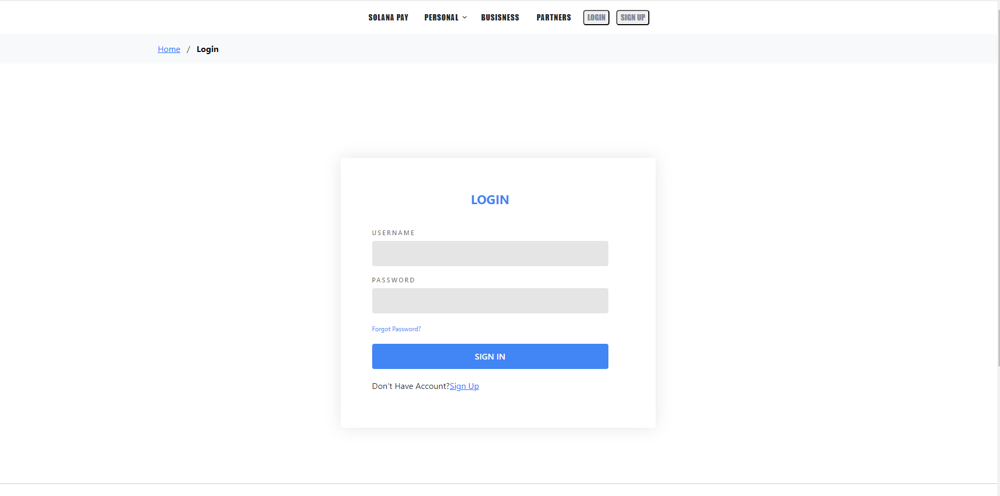
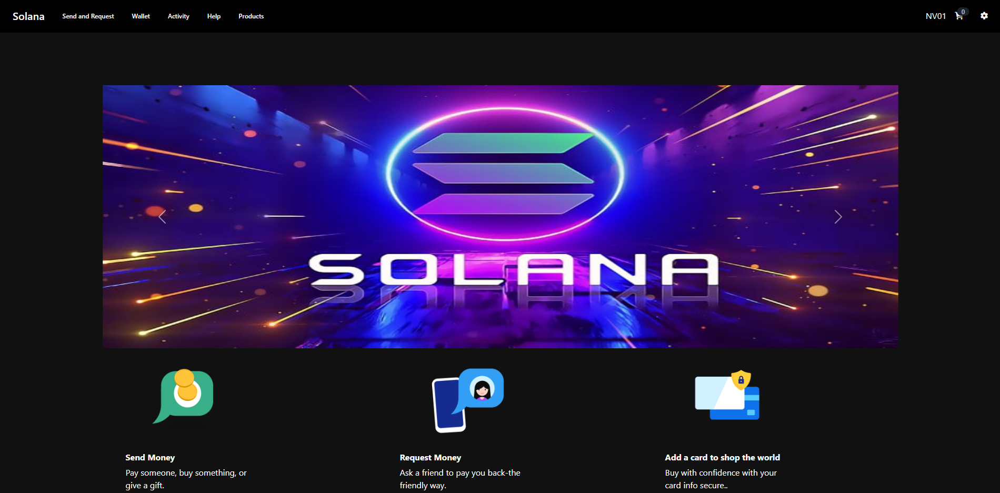
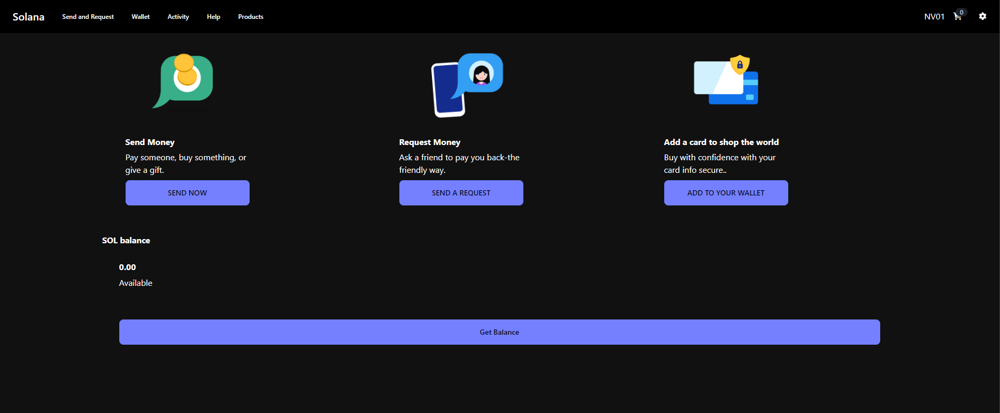
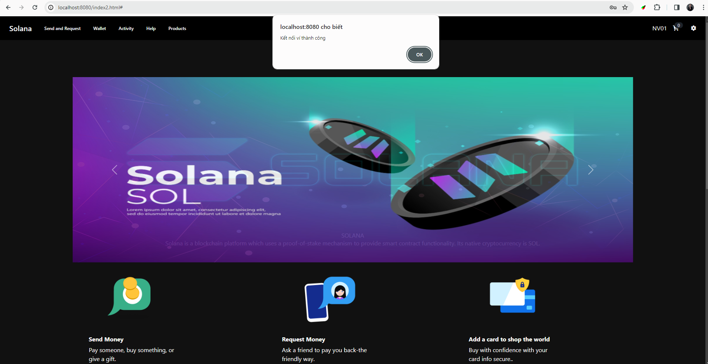
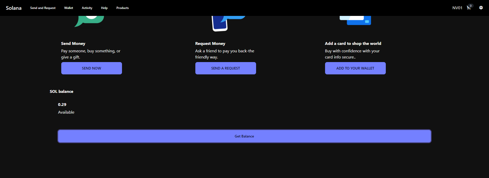
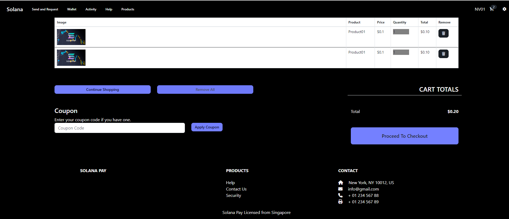
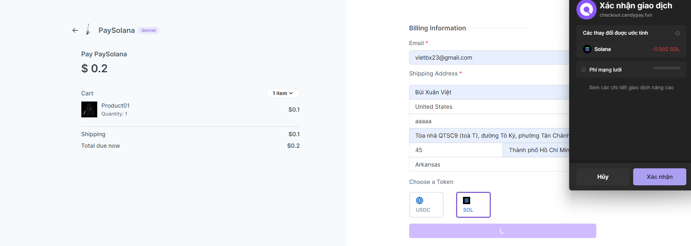
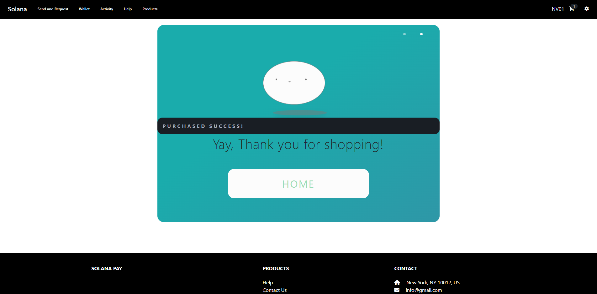

# Solona Private Payment

## Introduction

Solona Private Payment is a blockchain project built on the Solana platform, focusing on improving security and privacy in transactions. This project aims to provide a secure and private payment experience for users on the Solana blockchain network.

## Features

- **Transaction Security:** Utilizes advanced encryption technologies and security methods to ensure the integrity and safety of transactions.

- **Privacy:** Conceals identification information and personal details during transactions, helping users maintain their privacy.

- **Scalability and Compatibility:** Compatible with the overall infrastructure of the Solana blockchain, ensuring scalability and performance.

- **Integration with Wallets and Other Apps:** Easily integrates with cryptocurrency wallets and other applications to create a comprehensive private payment experience.

- **Credit Card Payments:** Connects with credit cards to expand payment options and convenience for users.

- **Private Shopping Payments:** Supports private payments during online shopping, ensuring safety and security for users.

## Connecting with Credit Cards

To connect with credit cards, users need to provide account information and undergo account verification steps. Afterward, users can easily make credit card payments through our application.

## Private Shopping Payments

This feature enables users to make online purchases without worrying about disclosing personal information. All shopping transactions are conducted safely and securely.

## interface is not logged in

## login interface

## main interface

## Connect phantom wallet

## check phantom account

## cart interface

## payment interface

## Payment success
